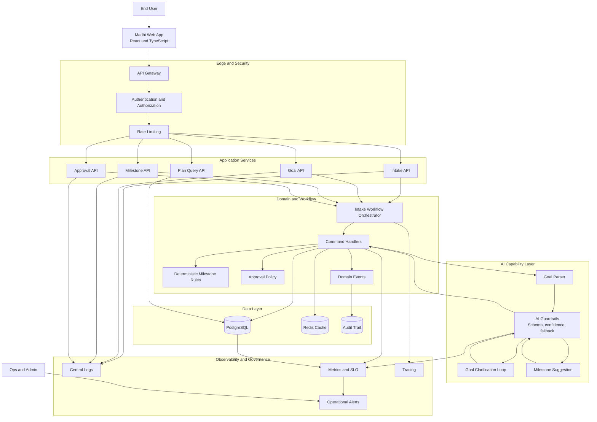

# Madhi — Design Summary

Madhi is a personal planning and decision-support system for Indian users. The product is designed to help people understand their goals, current constraints, and tradeoffs without turning the experience into a generic finance chatbot or a black-box advisory layer.

The system is structured around the idea that people need clarity, not just answers. Madhi captures structured financial and personal context; converts goals into explicit milestones; identifies feasible paths; explains tradeoffs; and helps users track progress over time.

## Product intent

The core product intent is simple:

- capture the user's current reality
- understand what they want to achieve and by when
- compute possible paths given constraints
- explain what is feasible, what is not, and why
- allow the user to review and approve generated plan steps

The outputs are framed as planning scenarios and assumptions, not as regulated financial advice.

## Design principle

Madhi is not built as an AI-first app with AI everywhere. It is built as a domain-driven system where each capability is assigned to the correct layer:

- deterministic logic handles feasibility, variance, tax calculations, and validation
- AI handles bounded interpretation, explanation, and ambiguity resolution
- the user remains the final decision-maker through approval gates
- business rules and workflow transitions are modeled explicitly instead of being hidden in controllers or prompts

This makes the product realistic, explainable, and extensible.

## Product scope

Madhi supports the following core workflows:

- intake of personal and financial context
- parsing free-text goals into structured goal objects
- milestone generation and approval
- scenario-based planning for competing goals
- allocation guidance across asset classes
- tax gap awareness and planning context
- statement parsing and transaction review
- variance tracking and alert investigation

The design intentionally stays within a bounded product surface. It does not claim to provide direct financial advice or to recommend specific securities/products.

## Architecture direction

The architecture is intentionally modeled as:

- frontend: React + TypeScript
- backend: Spring Boot
- domain: DDD and event-driven workflow design
- data: PostgreSQL, MongoDB, Redis
- AI integration: provider adapters and bounded model use

Akka is not the default implementation choice. It is reserved as a later runtime option only when orchestration complexity, supervision, and concurrency genuinely justify it.

## Phase 1 enterprise architecture diagram

## Phase roadmap

### Phase 1 — Intake + Milestone Setting
- structured profile capture
- free-text goal parsing
- deterministic rule engine for milestones
- AI-assisted milestone suggestions
- approval and plan persistence

### Phase 2 — Feasibility and Path Planning
- feasibility math for goals
- constrained optimization for competing goals
- tradeoff explanations and alternative paths

### Phase 3 — Portfolio Guidance and Tax Planning
- allocation scenarios by category
- risk profile refinement and planning ranges
- tax-gap analysis and explanatory narration

### Phase 4 — Statement Parsing and Tracking
- CSV/PDF upload validation
- PII masking before AI processing
- transaction extraction and anomaly validation

### Phase 5+ — Alerts and Variance Monitoring
- tracking against the plan
- variance detection
- alert investigation and outcome explanation

## AI maturity path

The project is designed to evolve in a disciplined AI roadmap.

### Agentic AI in Madhi

Madhi uses bounded agentic workflows only where the next action depends on intermediate results. The current design identifies three clear loop patterns:

- Goal clarification loop (Phase 1): the system asks one targeted follow-up when the user's goal is ambiguous, then loops until the intent is clear enough to parse.
- PDF parsing pipeline (Phase 4): the system detects document format, extracts rows, normalizes transaction data, validates totals, and stops only when it has enough trustworthy output.
- Root-cause investigation loop (Phase 5): the system checks spending, income, and goal-change factors in sequence and decides the next investigation step based on what it learns.

These are not general-purpose autonomous agents. They are small, task-specific loops with a defined goal, available tools, stopping condition, and validation rule.

### RAG
Use RAG when the system needs current, grounded explanations derived from policy or domain documents.

Examples:
- tax guidance explanation
- EPF / PPF / NPS policy references
- regulatory or scheme context

### MCP
MCP is conceptually relevant as a future standardization layer for tool access, but it is not yet a claimed implementation detail of the current product. The system already has tool-like data sources and workflow steps for parsing, categorization, spending review, goal history, and income analysis, but the design does not yet explicitly name MCP as the protocol glue connecting them.

This is best understood as a future integration layer rather than a current product capability.

### Loop engineering

The real abstraction behind these patterns is loop engineering: the system defines the objective, tool access, intermediate state, and stopping condition before execution begins. This pattern applies both to project workflows and to the intended AI loops in the product. In other words, the product is designed as a set of controlled decision loops rather than as one monolithic AI assistant.

## Guardrails

The design explicitly protects against product risk and trust issues:

- no silent plan mutation by AI
- no direct financial advice framing
- no specific fund or stock recommendations
- no hidden assumptions in output generation
- sensitive financial inputs are masked before model access

## Why this is an AI capstone-worthy product

This is a strong capstone because it combines product thinking with realistic engineering complexity:

- workflow design instead of throwaway demos
- deterministic-first architecture
- bounded AI use with clear responsibility boundaries
- retrieval and agentic capability planning
- product trust, safety, and explainability

It demonstrates how to build an AI product that is useful, structured, and credible rather than merely “chatbot-like.”

## Project structure

- docs/ — product and architecture documentation
- design/ — HLD and LLD design artifacts
- architecture/ — architecture views and design records

## Status

This phase is intentionally focused on design and product clarity. The system direction is locked: domain-driven workflow design first, AI enrichment second, and advanced tool integration only when the workflow demands it.
